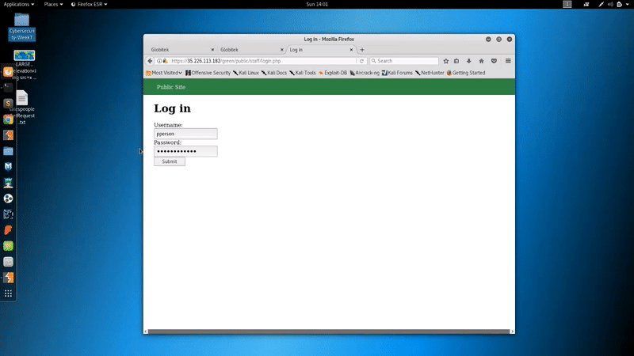
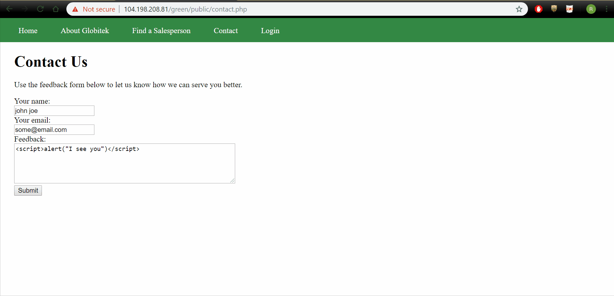

# Week-9-Project-Pentesting-Live-Targets

For this assignment, you will attack three live targets, each of which is a slightly modified version of the same web application, Globitek. The three targets are therefore mostly identical. However, each target has been given a different color menu bar—blue, green, red—and each one has two different security vulnerabilities.

# Challenge Goals:

**The following goals must be completed:**

1. **Username Enumeration:** A careless developer mistake has created a username enumeration vulnerability. Determine which color has the vulnerability. You can use the existing username "jmonroe99" as a test. Next, figure out what mistake the developer made.

2. **Insecure Direct Object Reference:** One of the three sites is missing code which would prevent some sensitive information from being made public. Determine which color has the vulnerability. Then, figure out what the other two sites did correctly to prevent the information leak.

3. **SQL Injection:** Most of the data input received by these websites is being sanitized properly. However, one of the three sites has one place where the input is not being sanitized before being used in an SQL query. Determine which color has the vulnerability.

4. **Cross-Site Scripting:** All three sites do a good job of protecting against a reflected XSS attack. However, one of the sites has a mistake which leaves the site vulnerable to a stored XSS attack. A reflected XSS attack would be easy to reveal, while a stored XSS does not provide instant feedback. You will need to log into the admin area and look through the CMS in order to "spring the trap" and find out if your attack succeeded. Determine which color has the vulnerability. Remember, others will be attacking these sites alongside you. Use your name in the XSS so that your results won't be confused with anyone else's (example: <script>alert('Mallory found the XSS!');</script>).

5. **Cross-Site Request Forgery:** One of the three sites does not have CSRF protections on the admin area. A clever attacker could design a form which would automatically submit form data to the staff area and take advantage of a logged in user's access permissions. Be the attacker and design a form which will make a change to the spelling of some database content. (For example, change the first user from "James" to "Jim", or change "Alabama" to "Alabamaaaa".) Then point the form action at each of the three sites to find out which color has the vulnerability. Do not neglect to be stealthy with your form—your unsuspecting, logged-in admin should neither see the form nor the results of the form submission.

6. **Session Hijacking/Fixation:** Two of the three websites expire their active sessions and require users to re-login every 30 minutes. That is probably too aggressive for the real world, but it is better than the third site which allows sessions to be a year old, and never regenerates the session ID, even when the user agent string changes. This makes it vulnerable to both session hijacking and session fixation attacks.

# The following advanced goals are optional:

**Bonus Objective 1:** Build on Objective #3 (SQL Injection). Experiment to see what other kinds of information you can get the database to reveal.

**Bonus Objective 2:** Build on Objective #4 (Cross-Site Scripting). Experiment to see if you can use XSS to: a) direct the user to a new URL, b) read cookie data, c) set cookie data.

**Advanced Objective:** Build on Objectives #4 and #6 (XSS, hijacking/fixation). Are you able to execute a session hijacking or fixation attack using XSS instead of using the provided PHP script?

# Blue
**SQL Injection**
* The exploit exists in the salesperson.php page.
* The exploit is done via the url.
* Using the given ``` ' OR SLEEP(5)=0--' ``` statement, the page proceeds to wait 5 seconds before returning.


**Session Hijacking/Fixation**
* Use the tool to change your PHPSESSID to a logged in user's PHPSESSID: public/hacktools/change_session_id.php
* Have a user open a malicious website that sets their PHPSESSID to the attacker's PHPSESSID. The user will have to login again. This makes the attacker's PHPSESSID valid.


**Bonus Objectve 1**
* Use the id parameter in the url to infiltrate the system: /blue/public/staff/salespeople/show.php?id=1
* Explore the Database with sqlmap


# Green
**Username Enumeration**
* Go to the main login. If the wrong password is entered and the user exists, the error is bold. If the wrong password is entered and the user does not exist, the error just plain text.


**Cross-Site Scripting**
* Go to Contact Us and type the code ``` <script>alert("Put whatever you want here");</script> ```
* Then login with pperson like you do for CTF
* Go to feedback and see the pop-up


**Bonus Objective 2**
* It's the same as the XSS challenge but you use a new code ``` <script> window.location.assign("https://www.google.com")</script> ``` 


# Red
**Insecure Direct Object Reference**
* Use the public find a Salesperson tool to look for someone. After a Salesperson is found, use the id parameter in the url to look for other people in the system.

